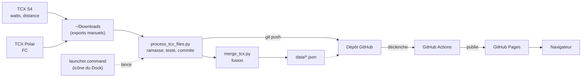
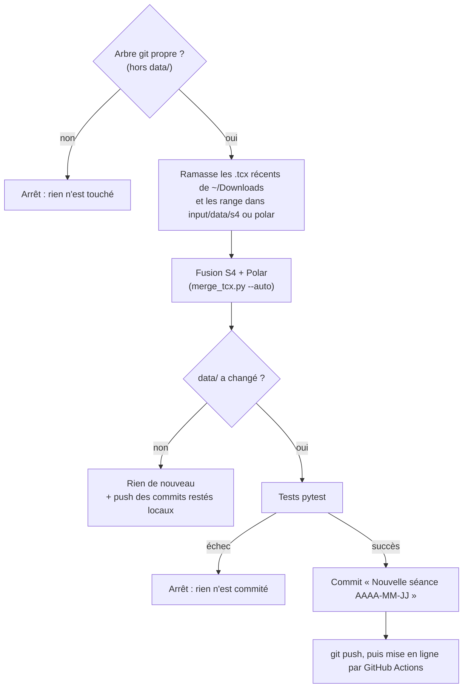
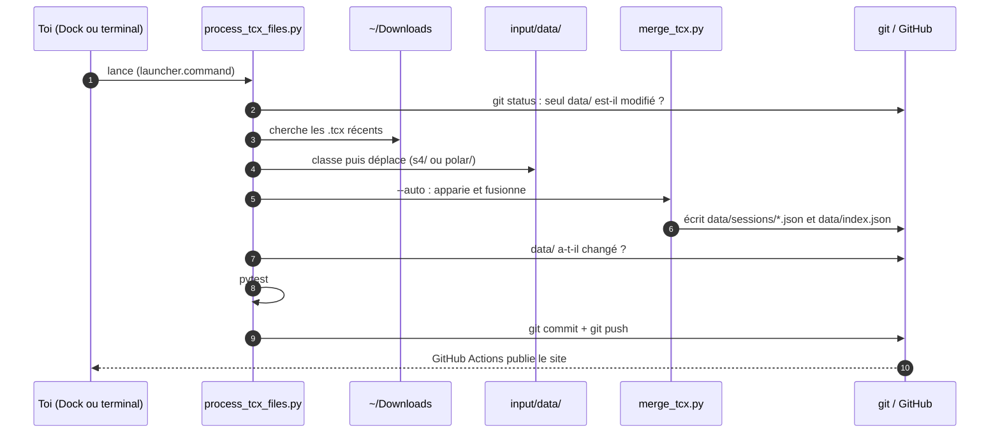
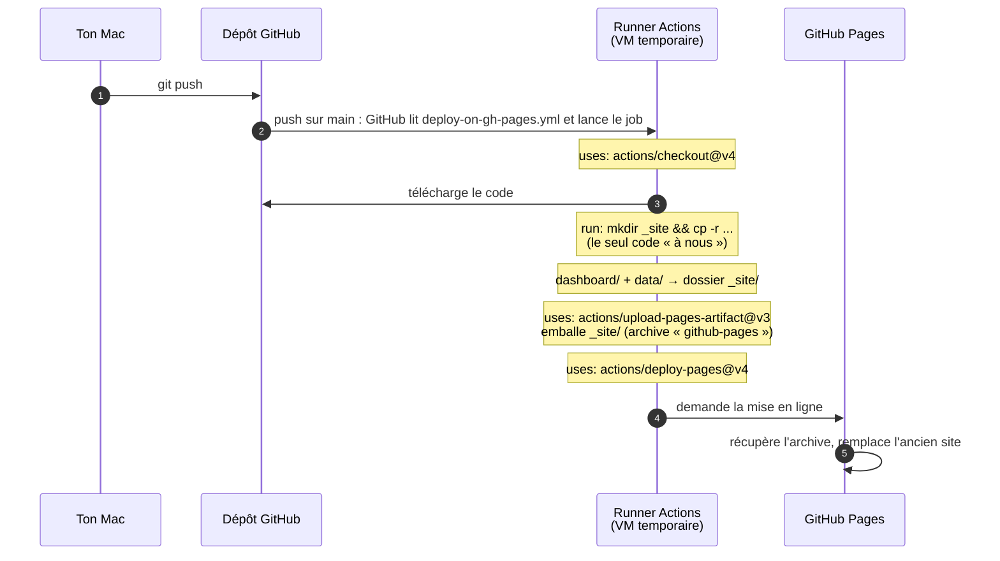
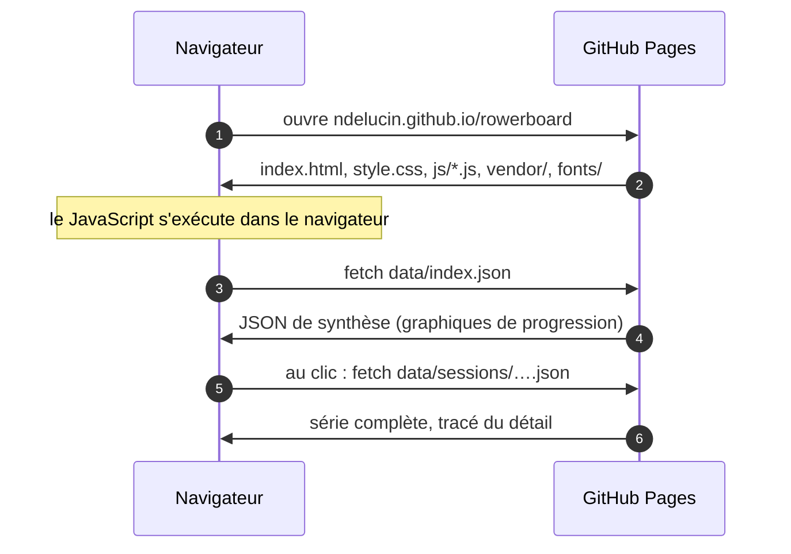

# Rowerboard

Suivi de séances de rameur : fusionne l'export des fichiers de données (TCX) du **WaterRower S4** (distance, watts, cadence) avec celui de la montre **Polar** (fréquence cardiaque), puis affiche le résultat dans un dashboard hébergé sur **GitHub Pages**.

Site : https://ndelucin.github.io/rowerboard/

> ⚠️ Le dépôt est public et les données ne sont **pas chiffrées** : FC et performances sont lisibles par tous. Le chiffrement est prévu (voir [Suite](#suite)).

**Sommaire**

- [Partie 1 · Le projet](#partie-1--le-projet) : à quoi sert le dépôt, comment il est organisé, comment l'utiliser
- [Partie 2 · Comprendre le fonctionnement](#partie-2--comprendre-le-fonctionnement) : explications pédagogiques (fusion, script de traitement, dashboard, GitHub Pages)

---

## Partie 1 · Le projet

### Objet

Deux appareils enregistrent la même séance, chacun de son côté : le rameur donne la puissance et la distance, la montre donne la fréquence cardiaque. Ce dépôt les réunit en une seule séance, calcule des indicateurs (allure, puissance, FC, efficience, zones de FC) et les affiche dans un tableau de bord.



Deux parties indépendantes, dont le seul point de contact est le JSON de `data/` :

1. **Scripts locaux** (Python) : `process_tcx_files.py` orchestre (ramassage des exports, tests, commit, push) et `merge_tcx.py` fusionne les deux TCX en JSON.
2. **Dashboard** (HTML + JavaScript) : lit ces JSON et dessine tableaux et graphiques.

### Structure du dépôt

| Chemin | Rôle |
|---|---|
| `scripts/merge_tcx.py` | Script de fusion des fichiers TCX (Python 3.9+, bibliothèque standard) |
| `scripts/process_tcx_files.py` | Ramasse les TCX exportés, fusionne, teste, commite et pousse (commande unique après une séance) |
| `scripts/launcher.command` | Lanceur macOS : double-clic ou icône du Dock, ouvre Terminal et exécute `process_tcx_files.py` |
| `scripts/tests/` | Tests `pytest` (fusion et traitement des exports) |
| `data/` | JSON générés, publiés sur GitHub |
| `dashboard/` | Site statique : `index.html`, `style.css`, `js/`, `vendor/` (Chart.js), `fonts/` |
| `docs/schema.md` | Format précis des JSON |
| `.github/workflows/deploy-on-gh-pages.yml` | Déploiement automatique sur Pages |
| `input/` | Exports TCX bruts. **Gitignoré, reste sur ta machine** |

### Objets principaux

| Objet | Ce que c'est |
|---|---|
| **Séance** | Une séance de rameur : un fichier `data/sessions/<id>.json` avec son résumé et toute la série de mesures. L'`id` est l'heure de début |
| **Catalogue** | `data/index.json` : la liste légère des séances (date, fichier, chiffres de synthèse), sans les séries |
| **Script de fusion** | `merge_tcx.py` : lit les TCX, produit le fichier séance correspondant et met à jour le catalogue |
| **Script de traitement** | `process_tcx_files.py` : la commande du quotidien. Range les exports, appelle la fusion, lance les tests, puis commite et pousse `data/` |
| **Lanceur** | `launcher.command` : raccourci macOS (Dock) vers le script de traitement |
| **Dashboard** | Le site : KPI, suivi de progression, historique, détail d'une séance |
| **Workflow Pages** | `deploy-on-gh-pages.yml` : assemble et publie le site à chaque push sur `main` |

### Utilisation

#### Ajouter une séance (cas courant)

Trois gestes, dont deux manuels :

1. Exporter le TCX du moniteur depuis [waterrowernohrdaccount.com](https://waterrowernohrdaccount.com/dashboard).
2. Exporter le TCX de la montre depuis [Polar Flow](https://flow.polar.com/diary).
3. Lancer le traitement, par l'icône du Dock (voir plus bas) ou en ligne de commande :

```bash
python3 scripts/process_tcx_files.py
```

Les deux exports doivent arriver dans `~/Downloads` (dossier de téléchargement par défaut du navigateur). Le script fait tout le reste :



Dans le détail :
1. **Ramassage** : seuls les `.tcx` modifiés dans les dernières 24 h sont pris. Chaque fichier est reconnu par son contenu (présence de Watts : WaterRower ; FC seule : Polar), pas par son nom. Les fichiers sont **déplacés** (pas copiés) vers `input/data/s4/` ou `input/data/polar/`.
2. **Fusion** : chaque S4 est apparié au Polar dont l'heure de début est la plus proche (à ±5 min). La FC max pour les zones est fixée à 180.
3. **Tests puis commit** : dès que `data/` a changé, les tests tournent. S'ils passent, `data/` est commité (« Nouvelle séance AAAA-MM-JJ », ou « Nouvelles séances … » s'il y en a plusieurs) et poussé.
4. **Mise en ligne** : le push déclenche le workflow Pages, et le site est à jour en une minute environ.

Un récapitulatif s'affiche dans le terminal : fichiers ramassés, séance créée (date · durée · distance · allure /2000 m), commit, push.

##### Lancer depuis le Dock (macOS)

`scripts/launcher.command` exécute la commande ci-dessus et garde la fenêtre ouverte jusqu'à une touche, pour lire le résultat ou l'erreur. Pour l'installer :

1. Dans le Finder, ouvrir le dossier `scripts/` du dépôt.
2. Glisser `launcher.command` dans la partie droite du Dock (à côté de la corbeille).
3. Au premier clic : clic droit sur l'icône, puis **Ouvrir**, pour valider l'avertissement de sécurité de macOS.

Le lanceur retrouve le dépôt à partir de son propre emplacement : il n'y a pas de chemin à configurer.

##### Garde-fous

- **Arbre git propre** : si autre chose que `data/` est modifié ou non suivi (y compris un nouveau fichier), le script s'arrête **avant** de toucher à quoi que ce soit. Il faut commiter ou ranger ces changements d'abord.
- **Tests obligatoires** : rien n'est commité si les tests échouent, y compris à la relance d'un traitement interrompu. Sans `.venv`, les tests sont sautés avec un avertissement : créer le venv (voir [Lancer les tests](#lancer-les-tests)).
- **Pas de doublon** : une séance est identifiée par son heure de début. Un fichier dont la séance est déjà rangée reste dans `~/Downloads`. Si seul le *nom* est déjà pris (par exemple `workout.tcx` d'une autre séance), le nouveau fichier est renommé avec son heure de début au lieu d'écraser l'ancien.
- **Fichiers inexploitables** : un TCX non reconnu ou sans heure de début est ignoré et laissé dans `~/Downloads`, avec un avertissement. Il ne bloque pas les autres.
- **Un seul export présent** : le script le signale et attend l'autre.
- **Push rattrapé** : si un push a échoué (réseau coupé), un commit reste local. À la prochaine exécution, même sans nouvelle séance, il est poussé.

##### En cas de problème

| Message ou symptôme | Que faire |
|---|---|
| `L'arbre git contient d'autres modifications…` | Commiter ou ranger les fichiers listés, puis relancer |
| `Il manque l'export Polar` (ou WaterRower) | Exporter l'autre fichier dans `~/Downloads`, puis relancer : le premier est déjà rangé dans `input/` |
| `Les tests échouent, rien n'est commité` | Corriger la cause, puis relancer. Les TCX sont déjà dans `input/` et `data/` déjà régénéré : le script relance simplement les tests puis commite |
| `TCX non reconnu ou sans heure de début` | Le fichier n'est pas un export S4 ou Polar valide : le réexporter |
| `Déjà présent (même séance)` | Cette séance est déjà dans `input/` : rien à faire |
| Aucun fichier ramassé alors qu'il existe | Il date de plus de 24 h : relancer avec `--since 72`, ou `--downloads` s'il est ailleurs |
| `(FC partielle !)` | Le fichier Polar couvre moins de la moitié de la séance : la FC et les zones sont peu fiables |
| Push refusé ou réseau coupé | Relancer plus tard : le commit local sera poussé |

> ⚠️ `input/` est gitignoré et les exports y sont **déplacés** : c'est la seule copie des TCX bruts. À sauvegarder si on tient à pouvoir régénérer `data/`.

| Option | Effet |
|---|---|
| `--dry-run` | montre ce qui serait ramassé, sans rien déplacer ni pousser |
| `--no-push` | commit local, sans `git push` |
| `--since N` | prend les fichiers des N dernières heures (défaut 24) |
| `--downloads DIR` | autre dossier que `~/Downloads` |

#### Ajouter une séance à la main

Sans `process_tcx_files.py` : dépose les deux exports dans `input/data/s4/` et `input/data/polar/`, puis :

```bash
python3 scripts/merge_tcx.py --auto
git add data && git commit -m "Nouvelle séance" && git push
```

`--auto` apparie chaque fichier S4 au fichier Polar dont l'heure de début est la plus proche (à ±5 min près). On peut aussi fusionner un couple précis :

```bash
python3 scripts/merge_tcx.py --s4 fichier_s4.tcx --polar fichier_polar.tcx --fcmax 180
```

Relancer la fusion ne crée pas de doublon : une séance est identifiée par son heure de début.

#### Tester en local

```bash
rm -rf _site && mkdir _site && cp -r dashboard/. _site/ && cp -r data _site/data
cd _site && python3 -m http.server 8000
```

Puis ouvrir http://localhost:8000. Il faut refaire la copie après chaque modification.

#### Lancer les tests

```bash
python3 -m venv .venv && .venv/bin/pip install -r requirements.txt
.venv/bin/pytest scripts
```

Les tests du traitement fabriquent leurs propres TCX dans un dépôt git temporaire. Quelques tests de fusion lisent en plus les vrais exports de `input/` et sont sautés s'il est absent.

### Sécurité

- Un dépôt public peut être **lu et cloné** par tous, mais seuls le propriétaire et les collaborateurs invités peuvent y **écrire**. Les inconnus ne peuvent que forker et proposer une pull request.
- Les vrais risques : compromission du compte GitHub (activer la double authentification), erreur de manipulation (`push --force`), et surtout la **confidentialité** des données, aujourd'hui en clair.
- Le site ne fait aucune requête vers un tiers : Chart.js et la police sont hébergés avec le reste.
- `input/` n'est jamais publié, et `merge_tcx.py` régénère `data/` depuis lui : rien n'est perdu si le dépôt est altéré.

### Suite

- **Chiffrement** des JSON (AES-GCM, clé dérivée d'un mot de passe) avec déchiffrement dans le navigateur (WebCrypto). Le point d'entrée prévu côté dashboard est `loadJson` dans `dashboard/js/data.js`. `index.json` devra être chiffré lui aussi.

---

## Partie 2 · Comprendre le fonctionnement

Cette partie explique comment les choses marchent, pour pouvoir modifier le projet en comprenant ce qu'on touche.

### 2.1 La fusion des données

#### Ce que fait le script

- Lit le TCX S4 (un point toutes les 3-4 s) et le TCX Polar (un point par seconde).
- Pour chaque point S4, prend la FC Polar la plus proche dans le temps, avec une tolérance de 15 s. Au-delà, la FC est absente (`null`).
- Calcule le résumé : allure /500 m (le dashboard l'affiche au /2000 m, soit ×4), watts moyens et max, FC moyenne et max, efficience (watts / bpm), répartition dans les 5 zones de FC (60/70/80/90 % de la FC max).
- Signale un `overlapWarning` si le fichier Polar recouvre moins de la moitié de la séance.

#### `index.json` et les séances

- `data/sessions/<id>.json` : une séance complète, avec toute la série de mesures (plusieurs centaines de points). Format détaillé dans [docs/schema.md](docs/schema.md).
- `data/index.json` : le **catalogue léger** des séances. Une entrée par séance, avec date, chemin du fichier et chiffres de synthèse, mais sans la série.

Le dashboard charge d'abord `index.json` (indicateurs, historique et graphiques de progression), puis ne télécharge le fichier complet d'une séance que lorsqu'on clique dessus. GitHub Pages ne sait pas lister un dossier : sans index, le navigateur ne pourrait pas connaître les séances existantes. `index.json` est régénéré par le script, on ne le modifie pas à la main.

### 2.2 Le script de traitement

`process_tcx_files.py` ne calcule rien lui-même : il **orchestre**. La fusion reste dans `merge_tcx.py` (il l'importe), et le script ajoute autour la logistique : trouver les fichiers, protéger le dépôt, tester, publier.

#### Les étapes dans le code

| Fonction | Rôle |
|---|---|
| `classify` | Lit un TCX et le range : `s4` (contient des Watts), `polar` (FC sans Watts) ou rien (pas un TCX exploitable) |
| `collect` | Parcourt `~/Downloads`, ignore ce qui est trop ancien ou inexploitable, détecte les doublons par heure de début, déplace les fichiers vers `input/` |
| `dirty_paths`, `outside_data` | Lisent `git status` pour vérifier que seul `data/` est modifié |
| `committed_index` | Lit `data/index.json` **tel qu'il est dans le dernier commit** : sert à savoir quelles séances sont nouvelles |
| `unpushed_count` | Compte les commits locaux pas encore poussés |
| `run_pytest` | Lance les tests du `.venv` ; leur échec arrête tout |
| `describe` | Met en forme la ligne de résumé d'une séance |
| `process` | Enchaîne le tout (voir le schéma ci-dessous) |
| `main` | Lit les options de la ligne de commande et affiche les erreurs proprement |



#### Choix de conception

- **Reconnaître par le contenu, pas par le nom** : les noms d'export changent selon l'appareil et la date ; la présence de Watts distingue sans ambiguïté le S4 de la montre.
- **« Nouveau » = absent du dernier commit**, pas absent du disque. Si un traitement précédent a fusionné puis échoué aux tests, la séance est déjà dans `data/` mais pas dans git : la comparer au disque la ferait passer pour « ancienne » et contournerait les tests.
- **Tests avant commit, toujours** : dès que `data/` a changé, quelle que soit la raison.
- **Rien n'est commité tant que l'arbre n'est pas propre** : `git add data` ne doit embarquer que des sorties de la fusion.
- **Un fichier illisible n'en bloque pas d'autres** : il est ignoré au ramassage, et la fusion saute une paire fautive pour continuer avec les suivantes (en renvoyant un code d'erreur à la fin).
- **Déplacer plutôt que copier** : `~/Downloads` reste propre et un second passage ne retrouve pas les mêmes fichiers. Contrepartie : `input/` devient l'unique copie.

### 2.3 Le dashboard

Le dashboard est un site **statique sans build** : on écrit des fichiers HTML, CSS et JavaScript, et le navigateur les exécute tels quels. Il n'y a ni framework, ni `npm`, ni compilation.

#### Bibliothèques et techniques utilisées

| Élément | Rôle |
|---|---|
| **[Chart.js](https://www.chartjs.org/) 4.4.1** | Seule bibliothèque externe. Dessine tous les graphiques. Hébergée dans `dashboard/vendor/chart.umd.js` (licence MIT), chargée par une balise `<script>` dans `index.html` |
| Barlow Condensed | Police du titre, hébergée dans `dashboard/fonts/` (licence SIL OFL), déclarée par `@font-face` dans `style.css` |
| Modules ES (`import` / `export`) | Découpage du JavaScript en fichiers, natif au navigateur |
| `fetch` | Chargement des JSON de `data/` |
| `<details>` | Sections « Suivi de Progression » et « Historique des séances » repliables, sans JavaScript |
| Variables CSS, `prefers-color-scheme` | Thème clair/sombre (suit le système, avec un bouton pour forcer) |
| `localStorage` | Mémorise le thème choisi (dans un `try/catch`, la page marche s'il est indisponible) |

#### Arborescence du site

Telle que publiée sur Pages (le dossier `_site/` assemblé par le workflow) :

```
/                       ← https://ndelucin.github.io/rowerboard/
├── index.html          structure de la page : KPI, progression, historique, détail
├── style.css           thème, mise en page, responsive
├── vendor/chart.umd.js Chart.js 4.4.1 (hébergé, pas de CDN)
├── fonts/              police du titre (woff2)
├── js/
│   ├── main.js         point d'entrée : charge le catalogue et orchestre les modules
│   ├── state.js        état partagé (séances, tri, sélection) et utilitaires DOM
│   ├── theme.js        thème clair / sombre
│   ├── kpis.js         cartes KPI et sous-titre de l'en-tête
│   ├── history.js      tableau d'historique triable
│   ├── detail.js       panneau « Détails de la séance » et flèches ↑ ↓
│   ├── data.js         seul accès aux données (fetch + cache)
│   ├── charts.js       tous les graphiques Chart.js
│   └── format.js       formats d'affichage (durée, allure, dates, nombres en fr-FR)
└── data/
    ├── index.json
    └── sessions/<id>.json
```

#### Algorithme général

Au chargement, `main.js` déroule ces étapes :

1. **Thème** (`theme.js`) : applique le thème mémorisé, s'il y en a un.
2. **Catalogue** : `loadIndex()` télécharge `data/index.json`. S'il est vide ou en erreur, un message s'affiche dans la page.
3. **Vue d'ensemble**, calculée uniquement à partir du catalogue, donc sans charger aucune séance :
   - les cartes KPI (`kpis.js`) : cumul (séances, durée, distance), dernière allure /2000 m, FC moyenne, durée et efficience, avec l'écart par rapport à la séance précédente ;
   - le tableau d'historique (`history.js`), triable en cliquant sur un en-tête de colonne ;
   - les 4 graphiques de progression (une valeur par séance).
4. **Détail** : la dernière séance est sélectionnée automatiquement, puis chaque clic sur une ligne de l'historique, ou sur les flèches ↑ ↓ du panneau (elles suivent l'ordre du tableau), déclenche `select(id)` :
   - `loadSession()` télécharge `data/sessions/<id>.json`. Le résultat est mis en cache, donc revenir sur une séance ne relance pas de requête ;
   - si l'utilisateur a cliqué sur une autre séance entre-temps, la réponse tardive est ignorée ;
   - `detail.js` affiche le résumé et les zones de FC, puis `charts.detail()` trace puissance + FC, allure et cadence.
5. **Allure instantanée** : elle n'est pas dans les données. `charts.js` la calcule à partir de la distance, sur une fenêtre glissante de 30 s (`500 × durée / distance`), et écarte les valeurs hors de 1:00–5:00 /500 m, qui correspondent à des pauses. Elle est ensuite affichée au /2000 m.
6. **Changement de thème** : les graphiques relisent leurs couleurs dans les variables CSS, donc on les redessine après un basculement.

Tout se passe dans le navigateur : le serveur (Pages) ne fait que servir les fichiers.

### 2.4 GitHub Pages et le déploiement

**GitHub Pages est un simple serveur de fichiers statiques** : pas de base de données, pas de code exécuté côté serveur. Tout le calcul de l'affichage se fait dans le navigateur du visiteur.

Avec la source « GitHub Actions » (réglage **Settings → Pages → Source**), le site publié n'est stocké dans aucune branche ni aucun dossier du dépôt. Il est construit puis envoyé à Pages par un workflow, et n'existe qu'à cet endroit.

#### Phase A : le déploiement (à chaque push sur `main`)



| Étape du workflow | Nature | Rôle |
|---|---|---|
| `actions/checkout@v4` | action GitHub | Télécharge le code du dépôt sur la machine |
| `run: mkdir _site ...` | **notre commande** | Assemble le site : `dashboard/` à la racine, `data/` dedans |
| `actions/upload-pages-artifact@v3` | action GitHub | Emballe `_site/` en archive, stockée par GitHub (elle ne parle pas encore à Pages) |
| `actions/deploy-pages@v4` | action GitHub | Demande à Pages de publier l'archive |

- `uses:` appelle une action réutilisable écrite par GitHub ; `run:` exécute une commande shell.
- `_site` est un simple nom de dossier, pas un mot-clé. Il figure dans `deploy-on-gh-pages.yml` (`path: _site`) et dans `.gitignore`.
- Après un push, le site est à jour en une trentaine de secondes. Onglet **Actions** : historique des runs, statut, logs.
- On ne voit pas `_site/` dans le dépôt : il n'existe que le temps du run. Une copie du dernier déploiement est téléchargeable dans l'onglet Actions (section « Artifacts », expire après un jour).

#### Phase B : quand quelqu'un ouvre le site



Le dépôt et Actions ne sont pas sollicités : Pages sert la dernière copie déployée.
