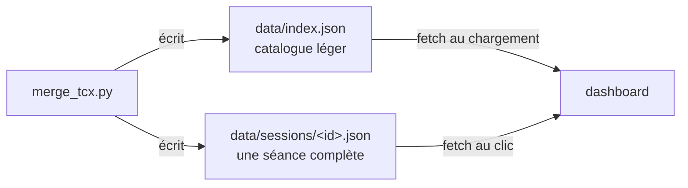

# Format des données (contrat script ↔ dashboard)

Produit par `scripts/merge_tcx.py` (appelé par `scripts/process_tcx_files.py`), lu par `dashboard/`. Toutes les durées sont en secondes, distances en mètres, dates en UTC (ISO 8601).



Les deux fichiers sont écrits ensemble et ne se modifient jamais à la main. Tout changement de format doit être reporté ici **et** dans `dashboard/`, et faire évoluer `version`.

## `data/index.json`
```json
{
  "version": 1,
  "sessions": [
    {
      "id": "2026-10-04T10:00:47Z",
      "date": "2026-10-04T10:00:47Z",
      "file": "sessions/2026-10-04T100047Z.json",
      "fcmaxAtSave": 180,
      "overlapWarning": false,
      "duration": 1290.422, "distance": 5028.0, "calories": 261.0, "caloriesPolar": 228.0,
      "avgWatts": 129.4, "maxWatts": 172.0, "avgCadence": 17.72, "avgHr": 135.71, "maxHr": 156.0,
      "avgPace500": 128.32, "efficiency": 0.9535, "zonePct": [9, 10, 40, 41, 0]
    }
  ]
}
```
- Une entrée par séance : `id`, `date`, `file`, `fcmaxAtSave`, `overlapWarning`, suivis de **tous les champs de `summary`** à plat (sans la série).
- Trié par `date` croissante.
- `file` est relatif à `data/`.
- Mis à jour de façon idempotente : refusionner une séance remplace son entrée (même `id`), sans doublon.

## `data/sessions/<id>.json`
```json
{
  "version": 1,
  "id": "2026-09-15T18:07:17Z",
  "date": "2026-09-15T18:07:17Z",
  "fcmaxAtSave": 180,
  "summary": {
    "duration", "distance", "calories", "caloriesPolar",
    "avgWatts", "maxWatts", "avgCadence", "avgHr", "maxHr",
    "avgPace500",   // s / 500 m
    "efficiency",   // watts moyens / FC moyenne
    "zonePct"       // [Z1..Z5] en %, bornes 60/70/80/90 % de fcmaxAtSave ; null si pas de FC
  },
  "series": [ { "t": 0.0, "distance", "cadence", "watts", "strokeRate", "hr" } ],
  "overlapWarning": false
}
```

### Identité et nom de fichier
- `id` = `date` = heure du **premier point de mesure S4**, en UTC (`AAAA-MM-JJTHH:MM:SSZ`). Elle identifie la séance : la refusionner écrase le fichier au lieu d'en créer un autre.
- Nom du fichier : l'`id` sans les `:`, par exemple `2026-09-15T180717Z.json`.

### `summary`
| Champ | Origine | Détail |
|---|---|---|
| `duration`, `distance`, `calories` | TCX S4 (totaux du tour) | secondes, mètres, kcal |
| `caloriesPolar` | TCX Polar | kcal estimées par la montre |
| `avgWatts`, `maxWatts` | moyenne et maximum des points S4 | `avgWatts` arrondi à 2 décimales |
| `avgCadence` | moyenne des points S4 | 2 décimales |
| `avgHr`, `maxHr` | points S4 ayant une FC | `null` s'il n'y en a aucune |
| `avgPace500` | `duration / distance × 500` | s / 500 m ; le dashboard l'affiche au /2000 m (×4) |
| `efficiency` | `avgWatts / avgHr` | 4 décimales |
| `zonePct` | répartition des points avec FC | Z1 < 60 %, Z2 < 70 %, Z3 < 80 %, Z4 < 90 %, Z5 ≥ 90 % de `fcmaxAtSave` |

### `series`
- Un point par mesure S4 (~3-4 s). `t` = secondes depuis le premier point S4, 1 décimale.
- `distance` est cumulée (mètres depuis le début).
- `hr` : point Polar le plus proche à ±15 s, sinon `null` (par exemple au début, si la montre a démarré après le rameur).
- L'allure instantanée **n'est pas stockée** : le dashboard la calcule à partir de la distance.

### Champs de contrôle
- `fcmaxAtSave` : FC max utilisée pour calculer `zonePct` au moment de la fusion (180 par défaut). Les zones ne sont pas recalculées si cette valeur change plus tard.
- `overlapWarning` : `true` si le fichier Polar recouvre **moins de la moitié** de la durée de la séance. La FC moyenne et les zones sont alors peu fiables ; le script de traitement l'affiche (`FC partielle !`).

### Valeurs absentes
Une valeur absente ou invalide dans le TCX est `null` (jamais `0` ni chaîne vide). Le dashboard doit le tolérer partout.

## Chiffrement (prévu, non implémenté)
`version` permettra une enveloppe `{ version, salt, iv, ciphertext }` (AES-GCM, clé PBKDF2) à la place du JSON clair. `index.json` devra être chiffré lui aussi (le point d'entrée côté dashboard est `loadJson` dans `dashboard/js/data.js`).
